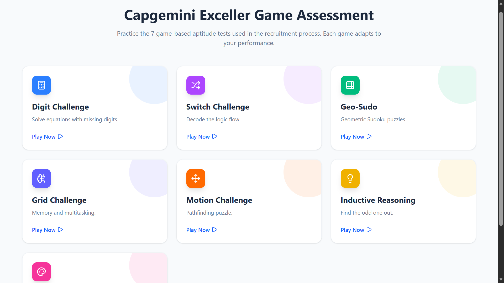
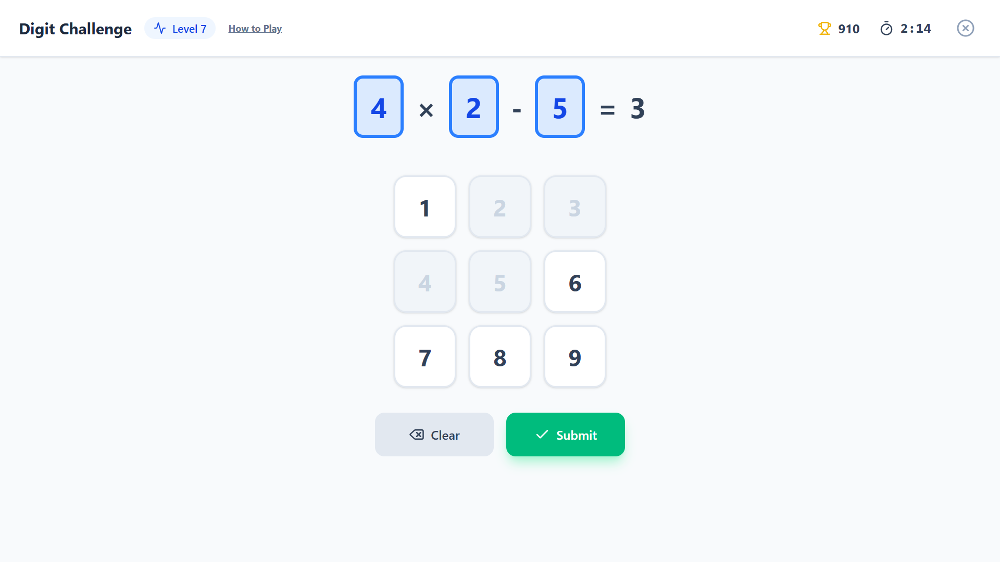
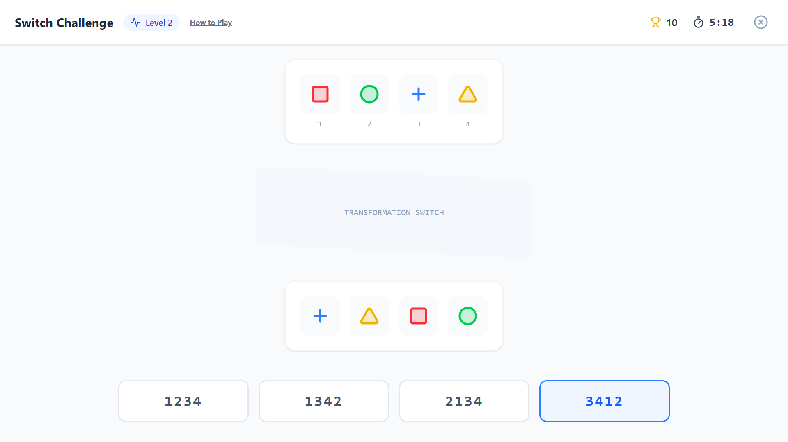
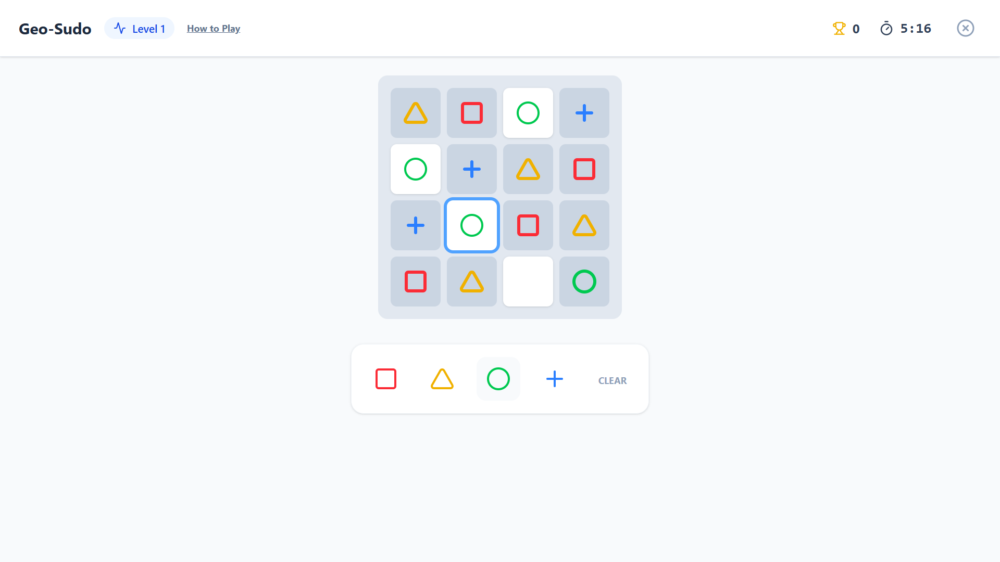
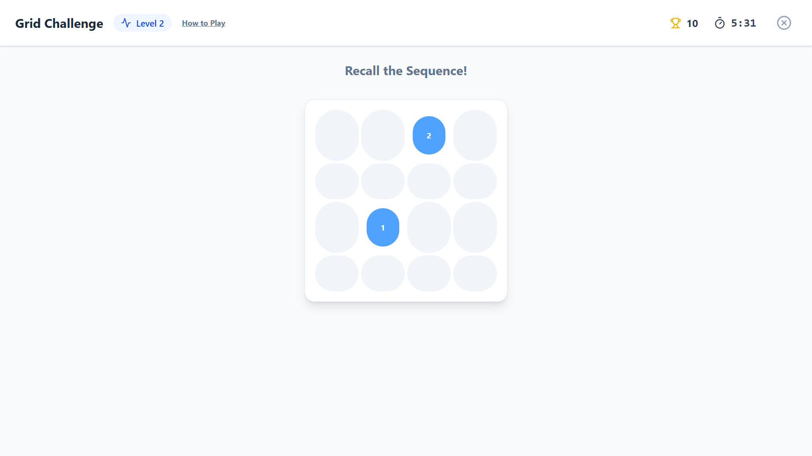
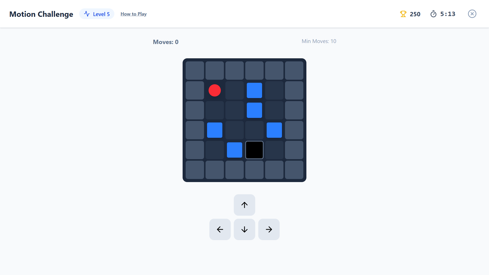
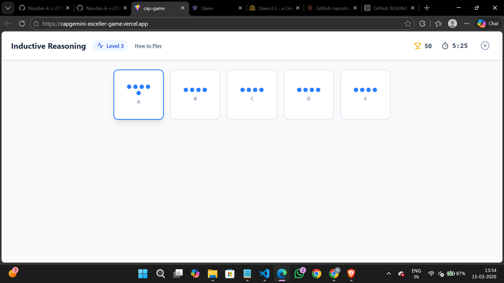
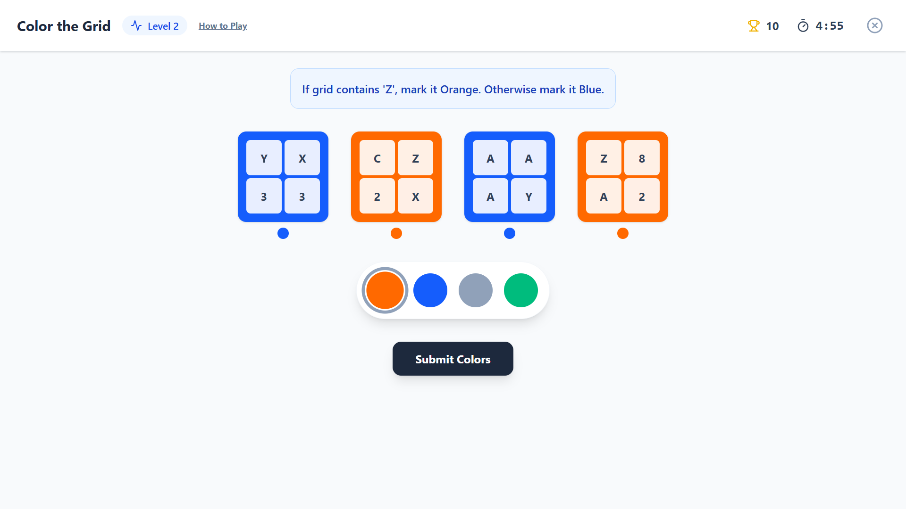
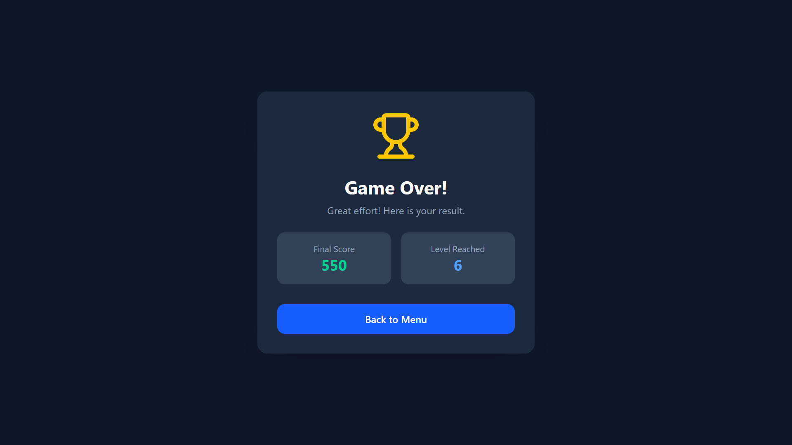

# Capgemini Exceller Game Assessment

A React + Vite based game-assessment simulator containing 7 cognitive mini-games inspired by aptitude-style screening rounds.

This project provides a structured game shell with timer, scoring, level progression, and distinct challenge mechanics across numerical, visual, memory, logic, and motion tasks.

## Live Project Goals

- Simulate multi-round, time-bound cognitive assessments.
- Provide a polished UI for game-based aptitude practice.
- Maintain reusable game architecture through shared context and shell components.
- Track core performance metrics like score and level progression.

## Latest Updates (March 2026)

- Improved lint coverage for `.js/.jsx` and React files by expanding ESLint configuration.
- Removed unsafe runtime expression evaluation from Digit Challenge and replaced it with safe deterministic evaluation.
- Replaced blocking browser `alert()` flows with inline, non-blocking game feedback.
- Refactored hook usage with stable callbacks and dependency-safe effects.
- Fixed `tsconfig.app.json` input detection for this JSX project by enabling JS includes.
- Performed a code cleanup pass to remove dead code and unused imports/state.

## Game Suite Overview

This assessment simulator includes **7 game modules**, each designed to target a different cognitive skill used in aptitude-style testing.

1. **Digit Challenge**: Missing-digit arithmetic and constraint handling.
2. **Switch Challenge**: Visual transformation mapping and permutation decoding.
3. **Geo-Sudo**: Sudoku-style symbol placement with row/column uniqueness.
4. **Grid Challenge**: Working memory under distraction and ordered recall.
5. **Motion Challenge**: Spatial planning and move optimization.
6. **Inductive Reasoning**: Pattern-break detection and abstract logic.
7. **Color the Grid**: Rule-based classification and fast condition checking.

## Detailed Game Breakdown

### 1) Digit Challenge

**What you do**
- Fill missing digits in arithmetic equations (e.g., addition/multiplication combinations).
- Use each digit under uniqueness constraints in the active puzzle state.

**How difficulty scales**
- Early levels focus on single missing slots.
- Mid levels combine operations and multiple missing positions.
- Higher levels increase missing slots and equation complexity.

**What it tests**
- Arithmetic speed
- Accuracy under constraints
- Mental verification

### 2) Switch Challenge

**What you do**
- Compare an input sequence of shapes with its transformed output sequence.
- Choose the correct 4-digit permutation code that explains the reorder.

**How difficulty scales**
- Core mechanic remains consistent.
- Pressure comes from speed, misdirection, and similar distractor options.

**What it tests**
- Mapping logic
- Pattern translation
- Rapid option elimination

### 3) Geo-Sudo

**What you do**
- Fill symbol grids using Sudoku-like constraints.
- Ensure each row/column has unique shapes with no duplicates.

**How difficulty scales**
- More cells are masked as level increases.
- Fewer fixed hints force stronger deduction.

**What it tests**
- Constraint satisfaction
- Visual deduction
- Error avoidance

### 4) Grid Challenge

**What you do**
- Memorize dot positions one-by-one.
- Answer an interleaved symmetry distraction prompt.
- Recall all dot positions in the original order.

**How difficulty scales**
- Grid size and sequence length increase with level.

**What it tests**
- Working memory
- Attention switching
- Ordered recall under interference

### 5) Motion Challenge

**What you do**
- Select and move pieces on a bounded board.
- Clear blocking paths and route the red ball into the target hole.

**How difficulty scales**
- Rotates through progressively tricky level templates.
- Efficiency pressure encourages lower move counts.

**What it tests**
- Spatial reasoning
- Planning ahead
- Move optimization

### 6) Inductive Reasoning

**What you do**
- Inspect a set of visual options.
- Identify the item that breaks the hidden rule.

**How difficulty scales**
- Procedural question generation changes rule forms (rotation/count patterns).
- Reduced predictability prevents rote memorization.

**What it tests**
- Abstract reasoning
- Rule inference
- Exception spotting

### 7) Color the Grid

**What you do**
- Read the active rule statement.
- Analyze each mini-grid and apply the correct color label.

**How difficulty scales**
- Rules alternate by content type (letters/numbers).
- Correctness depends on exact condition matching.

**What it tests**
- Conditional logic
- Classification speed
- Rule adherence

## Core Features

- **Unified game lifecycle** via a global game context.
- **Timer-based gameplay** with default 6-minute session duration per game.
- **Dynamic level progression** (level increases on correct answers).
- **Performance scoring model** tied to level and answer speed.
- **Reusable shell UI** for score, level, timer, quit, and instruction modal.
- **Instruction-first UX** with in-game tutorial modal for each game.
- **Modern animations** powered by Framer Motion.

## Scoring Logic

Implemented in `src/context/GameContext.jsx`:

- On correct submission:  
  `points = round((level^2 / max(1, timeTakenForLevel)) * 100)`
- `score += points`
- `level += 1`
- Timer decrements every second when state is `PLAYING`.
- Session transitions to `GAME_OVER` when timer reaches zero or user quits.

## Tech Stack

- **Frontend:** React 19, Vite 7
- **State Management:** React Context API (`GameContext`)
- **Animation:** Framer Motion
- **Icons:** Lucide React
- **Styling:** Utility-first classes (Tailwind-style utility usage)
- **Linting:** ESLint

## Project Structure

```text
src/
  App.jsx                        # Dashboard + game router
  context/
    GameContext.jsx              # Global game state, timer, scoring, progression
  components/
    shared/
      GameShell.jsx              # Shared game HUD, modal, game-over UI
  games/
    digit-challenge/
      DigitChallenge.jsx
    switch-challenge/
      SwitchChallenge.jsx
    geo-sudo/
      GeoSudo.jsx
    grid-challenge/
      GridChallenge.jsx
    motion-challenge/
      MotionChallenge.jsx
    inductive-reasoning/
      InductiveReasoning.jsx
    color-the-grid/
      ColorTheGrid.jsx
```

## Setup and Run

### Prerequisites

- Node.js 18+
- npm 9+

### Installation

```bash
npm install
```

### Start Development Server

```bash
npm run dev
```

### Build for Production

```bash
npm run build
```

### Preview Production Build

```bash
npm run preview
```

### Lint

```bash
npm run lint
```

## Screenshots

### Landing Page



### Digit Challenge



### Switch Challenge



### Geo-Sudo



### Grid Challenge



### Motion Challenge



### Inductive Reasoning



### Color the Grid



### Game Over Screen



## Gameplay Video

### Full Website Demo (All Games)

- Direct file link: [Demo_video.mp4](screenshots/Demo_video.mp4)

<video src="screenshots/Demo_video.mp4" controls width="900"></video>

## Gameplay Flow

1. User lands on dashboard and selects one of 7 games.
2. Global game context initializes timer, score, and level.
3. User solves interactive levels under time pressure.
4. Correct answers increase score and level.
5. Session ends on timer completion or manual quit.
6. Game Over view displays final score and highest level reached.

## Current Strengths

- Clean component decomposition between shell and game-specific logic.
- Consistent UX patterns across all mini-games.
- Scalable architecture for adding additional games.
- Strong visual feedback and interaction cues.

## Potential Improvements

- Persist high scores and session history (local storage or backend).
- Add per-game analytics and detailed result breakdown.
- Add reusable toast/snackbar system for richer feedback patterns.
- Improve puzzle generation depth and adaptive difficulty curves.
- Add sound design and accessibility enhancements.
- Add automated tests for game logic and context state transitions.

## Repository

GitHub: https://github.com/Nandan-k-s-27/capgemini-exceller-game

## License

This project is currently provided for educational and portfolio purposes.
